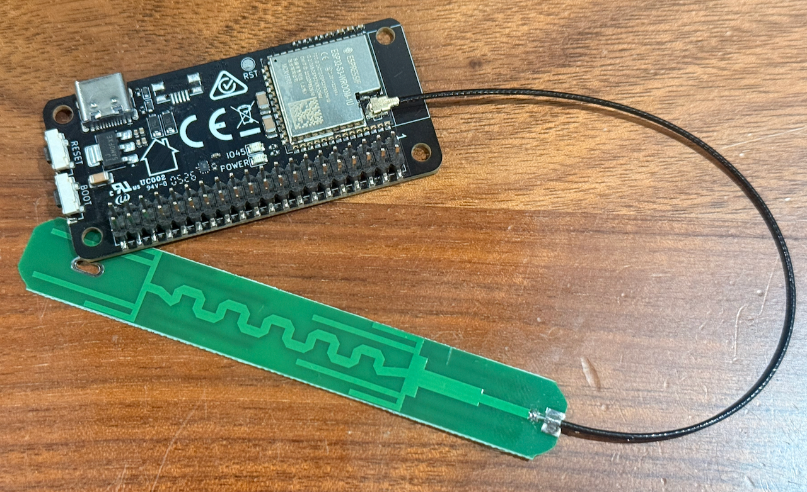

## Included Components

The Satellite1 Dev Kit comes in three pieces:

1. The "Hat" (round board)
2. The "Core" (rectangular board)
3. The Satellite1.1 external WiFi antenna

## Hardware Assembly

### Step 1: Attach the External Antenna

!!! note

    All dev kits ordered on or after February 17, 2026 include an external antenna for improved Wi-Fi strength. This antenna is required to connect the board to Wi-Fi. If the included antenna is too large for your setup, you can use a smaller antenna with an IPEX connector.

Press the antenna connector onto the connector on the Core board next to the ESP32 chip.

{ width="100%" }

### Step 2: Attach the Core to the Hat

Locate the Raspberry Pi standard 40-pin header on the Hat board. Carefully align the Core board's two rows of pins with the Hat's 40-pin connector, then press the boards together.

!!! note "Press Firmly!"

    The pins should protrude through the top of the Hat enough to be felt with your fingertips.

{ width="100%" }

!!! note "Compatibility"

    The Satellite1 Hat board can also be mounted to a Raspberry Pi Zero 2 W. Raspberry Pi firmware support is still in development. If you want to help test it, find us in the Discord community.

### Step 3: Power Up

!!! warning "Use the Correct USB-C Port"

    If you plug into the port labeled "XMOS", you will not hear audio from the Sat1 amplifier.

1. Plug in to the Hat's USB-C port labeled "CORE/ESP" using the 30 W USB-C power adapter and cable supplied with your dev kit.

2. On first boot, the blue LEDs will count down clockwise while the device flashes the XMOS audio processor.

3. When the LEDs begin sparkling warm white, the device is ready. Continue to [Connect Your Satellite1 to Home Assistant](satellite1-connecting-to-ha.md).
