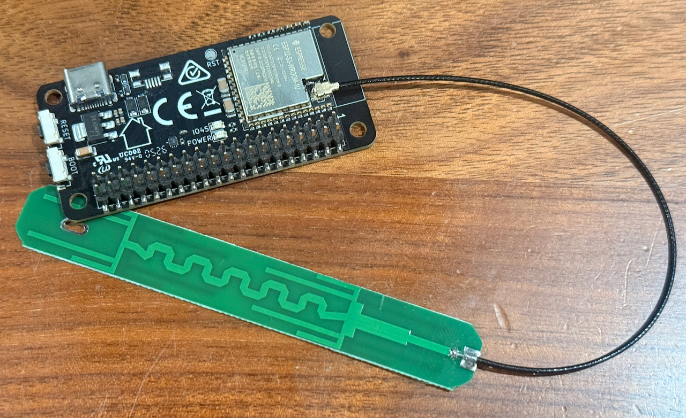
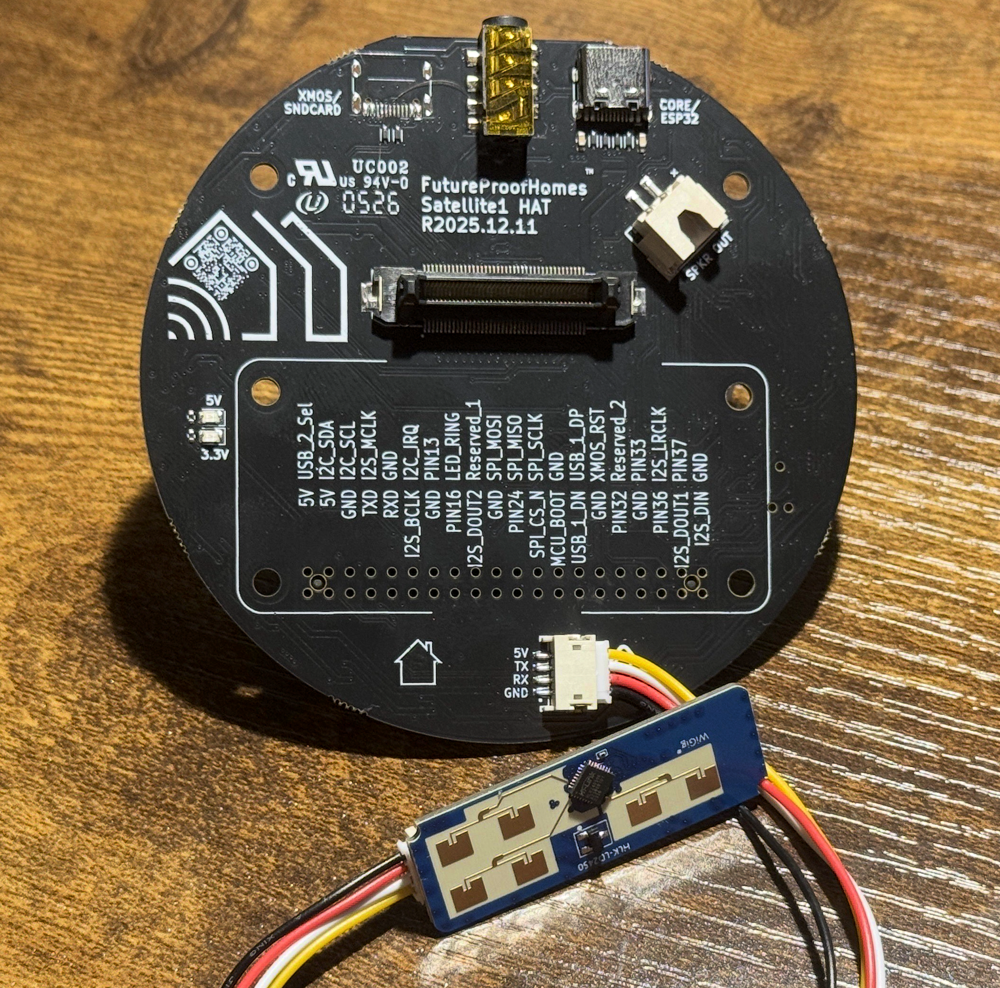
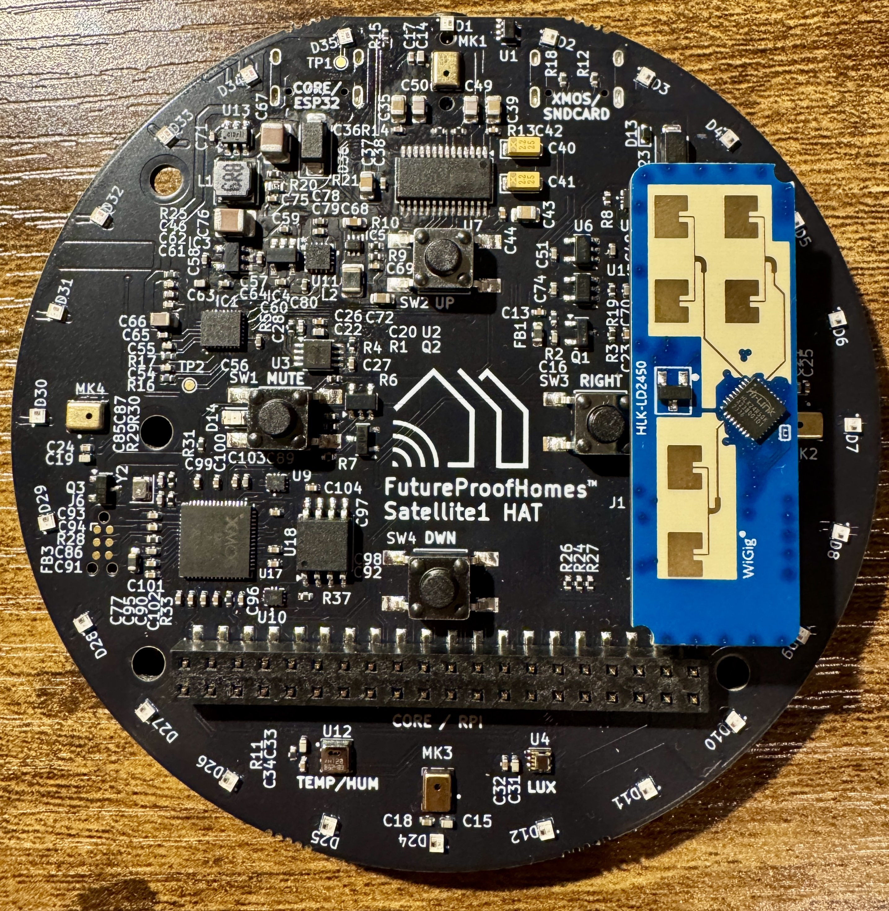
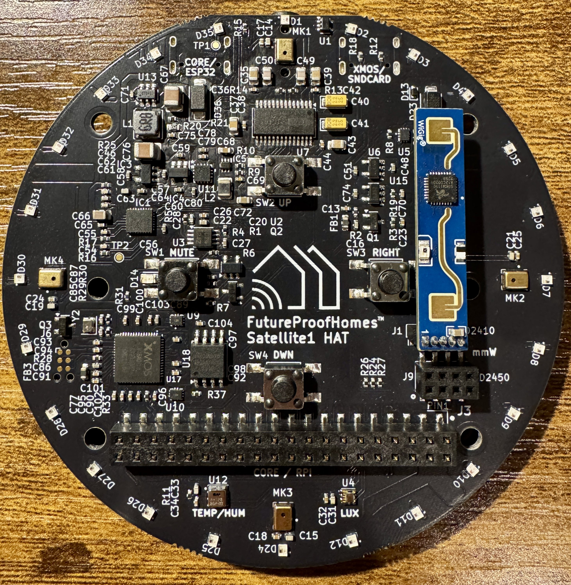
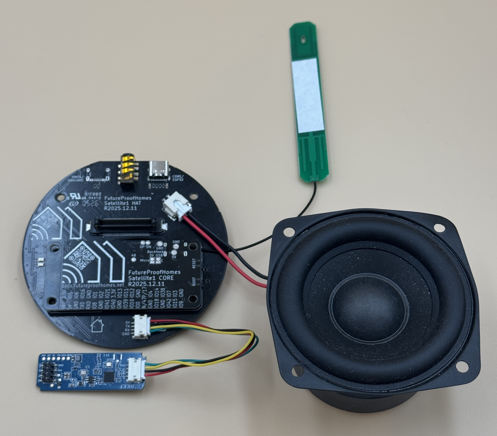
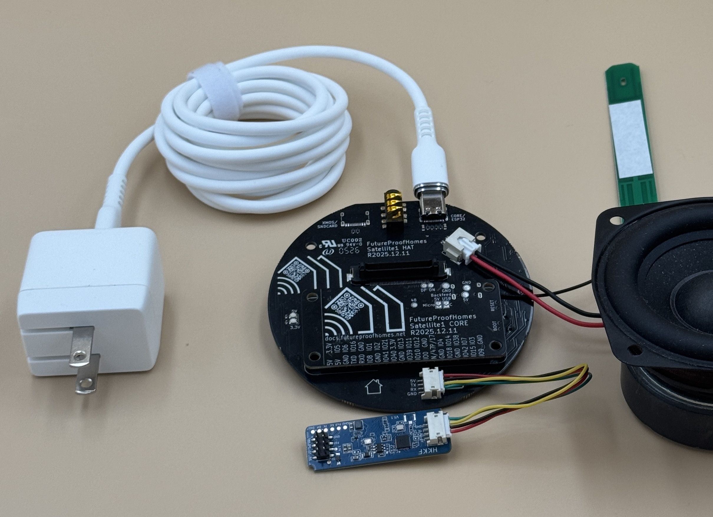

## Included Components

The [Satellite1 Dev Kit](https://futureproofhomes.net/products/satellite1-pcb-dev-kit) consists of a few components:

1. The "Hat" (round board)
2. The "Core" (rectangular board)
3. The 2.4Ghz WiFi antenna
4. The 30W USB-C power adapter and cable.
5. Optional [mmWave Sensor and cable.](https://futureproofhomes.net/products/ld2450-mmwave-human-presence-sensor)

## Hardware Assembly

### Step 1: Attach the External Antenna

!!! warning

    All Satellite1 ordered on or after February 17, 2026 include an external antenna for improved Wi-Fi strength. The antenna is required to connect the board to Wi-Fi. If the included antenna is too large for your setup, you can use a smaller antenna with an IPEX connector.

Gently press the antenna's connector onto the connector on the Core board next to the ESP32 chip.

{ width="100%" }

### Step 2: Attach the Core to the Hat

!!! note "Press Firmly!"

    The pins should protrude through the top of the Hat enough to be felt with your fingertips.

Locate the Raspberry Pi standard 40-pin header on the Hat board. Carefully align the Core board's two rows of pins with the Hat's 40-pin connector, then press the boards together.

{ width="100%" }

!!! question "Compatibility"

    Did you know the Satellite1 Hat board can also be mounted to a Raspberry Pi?  [Raspberry Pi firmware is still in development](https://github.com/FutureProofHomes/Satellite1-RPi-Image). If you want to help test it, find us in the [Discord community](https://discord.futureproofhomes.net).

### Step 3: Attach mmWave (Optional)

There are 3 ways to connect a mmWave human presence sensor to Satellite1. [Read more here.](satellite1-presence-sensors.md)

-  :material-numeric-1-circle:{ .lg .middle } __LD2450 Cable Connect (Recommended)__

    ---

    <figure markdown="span">
      { loading=lazy}
      <figcaption>Latest Sat1.1 Hat board offers a 4-pin JST cable.</figcaption>
    </figure>
    [Get LD2450 and Harness Cable](https://futureproofhomes.net/products/ld2450-mmwave-human-presence-sensor){ .md-button .md-button--primary }

-   :material-numeric-2-circle:{ .lg .middle } __LD2450 Direct Connect__

    ---

    <figure markdown="span">
      { loading=lazy}
      <figcaption>Original Sat1 with direct-mounted LD2450</figcaption>
    </figure>

-  :material-numeric-3-circle:{ .lg .middle } __LD2410 Direct Connect__

    ---

    <figure markdown="span">
      { loading=lazy}
      <figcaption>Original Sat1 with direct-mounted LD2410</figcaption>
    </figure>

### Step 4: Attach a Speaker

Attach a speaker driver of your choice to the Satellite1's amplified 30W JST-XH speaker connector. We recommend a 4-ohm full-range speaker rated to handle up to 30W, but smaller speakers and 8-ohm speakers will also work. Alternatively, you can connect an externally amplified speaker to the Satellite1's line-out/headphone jack.

{ width="100%" }

### Step 5: Attach USB-C Power

!!! warning "Use the Correct USB-C Port"

    If you plug into the USB port labeled "XMOS", you will not hear audio from the Sat1 amplifier.

1. Plug in to the Hat's USB-C port labeled "CORE/ESP" using the 30 W USB-C power adapter and cable supplied with your dev kit.

2. On first boot, the blue LEDs will count down clockwise while the device flashes the XMOS audio processor.

3. When the LEDs begin sparkling warm white, the device is ready. Continue to [Connect Your Satellite1 to Home Assistant](satellite1-connecting-to-ha.md).

{ width="100%" }
