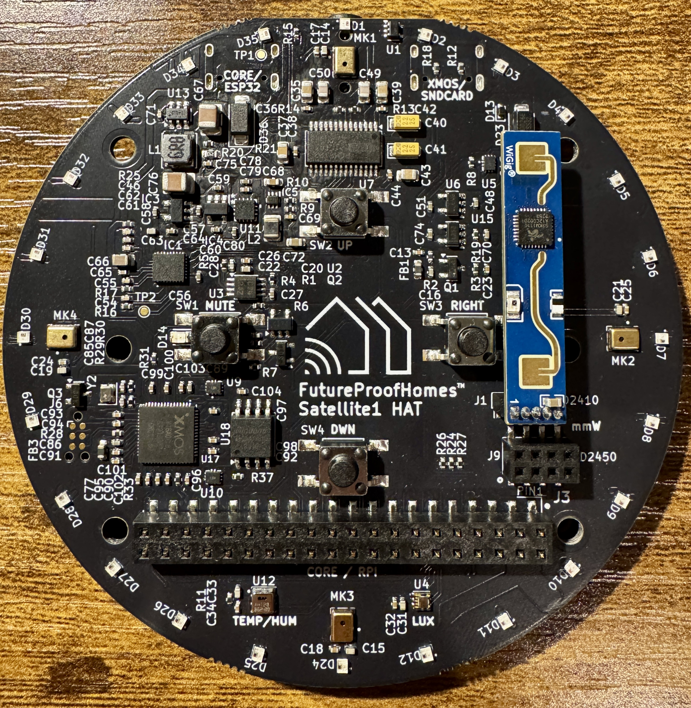
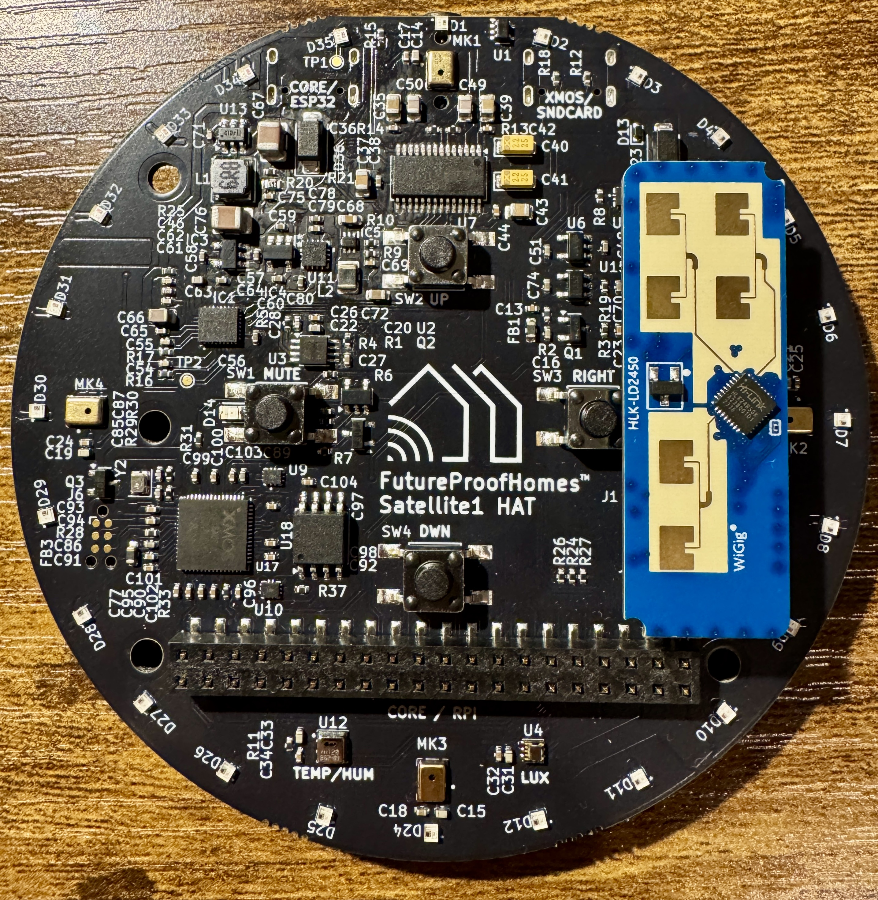

## Millimeter-wave presence sensors.
The Satellite1 HAT has two ports for optionally mounting external mmWave presence sensors: LD2410 or LD2450.  These sensors have different possibilities, and suit different needs.  Please read below.

<br>
<figure markdown="span">
  { width="100%" loading=lazy}
  <figcaption>LD2410 Mounted on Sat1 HAT</figcaption>
</figure>

<figure markdown="span">
  { width="100%" loading=lazy}
  <figcaption>LD2450 Mounted on Sat1 HAT</figcaption>
</figure>

### Sensor Positioning
When the sensor is directly mounted to the HAT it will point in the direction of the microphone and LEDs, which may work for your situation.  However, you can also use the sensors' included JST cable to position the sensor in any orientation you'd like so it is not directly mounted to the HAT.

{ width="100%" loading=lazy}

### Sensor Firmware
Both the LD2410 & LD2450 can be updated via the HLKRadarTool mobile app over bluetooth.  Watch this quick video to see how to access the sensor and change the firmware version:
<iframe style="width: 100%; aspect-ratio: 16 / 9;" src="https://www.youtube.com/embed/t8-JdVVVH34?si=3HRSFepdfceSfEtx" title="YouTube video player" frameborder="0" allow="accelerometer; autoplay; clipboard-write; encrypted-media; gyroscope; picture-in-picture; web-share" referrerpolicy="strict-origin-when-cross-origin" allowfullscreen></iframe>

<a href="https://apps.apple.com/us/app/hlkradartool/id1638651152">
  
</a>

<a href="https://play.google.com/store/apps/details?id=com.hlk.hlkradartool&hl=en_US&pli=1">
  
</a>


### mmWave Glossary
1. **Gate**: this sensor is using "gate" as definition of distance range. This is some range of distance, which can be tuned separately from others. Think of it as of "onion" layer, with center on sensor. There are 8 gates on LD2410 (plus gate 0, but it's effectively useless).
2. **Distance Resolution**: the "thickness" of one gate. The LD2410 can have resolution of 75cm or 20cm per gate. With resolution of 75cm per gate, maximum distance is `0.75 * 8 =` 6 meters (sorry my Imperial-units-friends), while with 20cm it's 1.6 meters. But with latter you can achieve much better precision.
3. **Energy**: basically "amount of presence" in the gate. The more actively you're moving - the more will energy there will be.

### Firmware Installation
???+ tip "The FutureProofHomes team is working on making this process seemless so you do not have to modify the firmware.  Please stay tuned."

1. [Follow these steps to modify the Sat1 Firmware](/modifying-the-firmware)
2. Add the correct code depening on your sensor and recompile then upload the firmware to your Sat1:
    1. For the LD2410: Uncomment the line `mmwave_ld2410: !include common/mmwave_ld2410.yaml` in the `OPTIONAL COMPONENTS` section of [satellite1.base.yaml](https://github.com/FutureProofHomes/Satellite1-ESPHome/blob/develop/config/satellite1.base.yaml#L89).
    1. For the LD2450: Uncomment the line `mmwave_ld2450: !include common/mmwave_ld2450.yaml` in `OPTIONAL COMPONENTS` section of [satellite1.base.yaml](https://github.com/FutureProofHomes/Satellite1-ESPHome/blob/develop/config/satellite1.base.yaml#L90).
4. Boot the Sat1 and check it's device page in Home Assistant after device reboot.  You should see a ton more entities in your Sat1 device page.


### About the LD2410(B)
This is small, but powerful sensor. It can sense motion and still human presence for distances up to 6 meters. It has a detection angle +/-60 degrees, and should be fine-tuned for best performance. Also it can see through glass walls, thin plywood etc.

<br>{ width="60%" loading=lazy }</br>
<br>[Get it on Amazon](https://amzn.to/3C6utsf){ .md-button .md-button--primary }

#### Configuration
Don't be overwhelmed with several dozens new entities that appeared after installation. They all are useful, and after fine-tuning the sensor you can disable those you not need.
Let's familarize ourselves with some useful entities:

1.  Binary sensors:
    1. **Moving target** - sensor of moving target presence.
    2. **Still target** - still presemce sensor. Mostly off, when moving target is present.
    3. **Presence** - main presence sensor. Populated by other two, with cooldown (see **Timeout** below).
2. Sensors:
    1. **Moving/still distance** - sensors of the distance to corresponding target.
    2. **G(1-8) moving/still energy** - the value of energy for corresponding gate.
3. Switches:
    1. **Engineering mode** - this switch will enable fine-tuning for sensor, and will report its readings to each gate in real time. Keep it off when not setting up your sensor, as it is pretty extensive operation.
    2. **Control Bluetooth** - enables built-in Bluetooth on sensor, so you could connect to it with HLK application and set it up from there. Useful, if you want to upgrade sensor firmware.
4. Select:
    1. **Distance resolution** - you can choose gate length 0.75m or 0.2m
5. Numbers:
    1. **Timeout** - will set the cooldown period for sensor (time from last presence detected to main presence sensor switching into "off" state).
    2. **Max moving/still distance gate** - will restrict sensor to certail distance. E.g. if it's set to 6, and distance resolution is 0.75 - max sensor triggering distance will be 4.5 meters.
    3. **G(1-8) moving/still threshold**  - this setting will set the threshold for presence detection for each gate (movement or still presence respectively). If amoung of energy for corresponding gate will be greater than this threshold - sensor will feel presence in that gate.
  
#### Calibration
The idea is simple: 

1. Set sensor in place, where its 120 degrees will be most useful, and catch the least of unnecessary movement.
2. Turn on **Engineering mode** switch.

???+ tip "Sensor Placement"
    - It works the best in the room corner, opposite to a table, or on the short wall of long room (e.g. bathroom). This is especially convenient, if you have shower with glass door on the opposite end.
    - It won't work in rooms with fans, or when it has dishwasher, or even running water in sight.

- Set the maximum gate based on room length. If you struggle with correct number, just wave hands or jump in opposite corner, see which gate detects movement, and set that number to **Max moving/still distance gate**. (Don't hesitate, set threshold a bit higher - that energy values can jump!)
- And finally, calibrate it for no presence: step out, let it set down for a bit (like a minute), and adjust moving and still thresholds, so they would be higher than energy levels for corresponding gates.

#### Helpful Calibration Card
We built UI card, to make calibration process more intuitive.
<br>{ width="100%" loading=lazy }</br>

Here's how to use it:

1. Install [Mushroom cards](https://github.com/piitaya/lovelace-mushroom), [Auto-entities card](https://github.com/thomasloven/lovelace-auto-entities) and [Decluttering card](https://github.com/custom-cards/decluttering-card) and [Bar card](https://github.com/custom-cards/bar-card) from HACS.
2. Put this to the very bottom of dashboard YAML in raw edit mode (this should be done once per dashboard):
```
decluttering_templates:
  ld2410:
    card:
      type: horizontal-stack
      cards:
        - type: custom:vertical-stack-in-card
          cards:
            - type: custom:mushroom-entity-card
              entity: switch.[[device]]_engineering_mode
              name: Preset edit mode
              icon_color: pink
              layout: horizontal
              tap_action:
                action: toggle
              hold_action:
                action: more-info
              double_tap_action:
                action: none
            - type: custom:mushroom-number-card
              entity: number.[[device]]_timeout
              name: Detection cooldown
              layout: horizontal
              display_mode: buttons
            - type: custom:mushroom-select-card
              entity: select.[[device]]_distance_resolution
              name: Gate resolution
              icon_color: green
              layout: horizontal
            - type: custom:mushroom-entity-card
              entity: switch.[[device]]_control_bluetooth
              icon_color: indigo
              name: Bluetooth
              tap_action:
                action: toggle
              hold_action:
                action: more-info
              double_tap_action:
                action: none
            - type: custom:mushroom-template-card
              secondary: >-
                {{ iif(is_state(entity, 'on'), 'Detected, ' +
                states('sensor.[[device]]_still_distance') + ' cm', 'Not
                detected') }}
              primary: 'Still presence'
              icon: mdi:motion-sensor
              entity: binary_sensor.[[device]]_still_target
              icon_color: ' red '
              layout: horizontal
              multiline_secondary: false
            - type: custom:mushroom-template-card
              secondary: >-
                {{ iif(is_state(entity, 'on'), 'Detected, ' +
                states('sensor.[[device]]_moving_distance') + ' cm', 'Not
                detected') }}
              primary: 'Moving presence'
              icon: mdi:motion-sensor
              entity: binary_sensor.[[device]]_moving_target
              icon_color: ' red '
              layout: horizontal
              multiline_secondary: false
          title: 'Settings: common'
        - type: custom:decluttering-card
          template: ld2410_gates
          variables:
            - device: '[[device]]'
            - type: still
        - type: custom:decluttering-card
          template: ld2410_gates
          variables:
            - device: '[[device]]'
            - type: moving
  ld2410_gates:
    card:
      type: custom:auto-entities
      filter:
        template: >-
          [ 
          {{
          dict(
            type='custom:mushroom-number-card',
            entity='number.[[device]]_max_[[type]]_distance_gate',
            name='Max detection gate',
            display_mode='buttons',
            icon='mdi:tape-measure',
            layout='horizontal',
            secondary_info='none',
            icon_color='green',
          )
          }},
            {{
          dict(
            type='custom:mushroom-number-card',
            entity='number.[[device]]_g' + i|string + '_[[type]]_threshold',
            display_mode='slider',
            icon_type='none',
            primary_info='name',
            secondary_info='state',
            name='Gate ' + i|string,
            card_mod={
              'style':
                {
                  'mushroom-number-value-control$': {
                     'mushroom-slider$': '.slider { height: 24px !important;}'
                  },
                  '.':'mushroom-number-value-control {height: 24px;}'
                }
            }
          )
          }},
          {{
          dict(
            type='custom:bar-card',
            direction='right',
            columns=1,
            height=16,
            positions=dict(
              indicator='off',
              icon='off',
              name='off',
            ),
            entities=[
                {
                  'entity': 'sensor.[[device]]_g' + i|string + '_[[type]]_energy',
                  'color': 'orange'
                }
              ]
          )
          }},
          
          ]
      card_param: cards
      card:
        type: custom:vertical-stack-in-card
        title: 'Gates: [[type]]'
```
3. Put following card to your dashboard. Replace `device` field value with with your satellite name, as it appears in entities IDs, like `satellite1_92fb28`.
```
type: custom:decluttering-card
template: ld2410
variables:
    - device: satellite1_9a72b3
```
Blue bars are threshold sliders. Orange bars are energy indicators.
That's it! Happy building!


### About the LD2450
This is physically bigger and even more powerful presence sensor. It can track the motion for 3 moving occupants in the room while also detecting still human presence for distances up to 8 meters. It has a detection angle +/-60 degrees, and should be fine-tuned for best performance. Also it can see through glass walls, thin plywood etc.

???+ warning "The LD2450 must be running firmware version V2.02.23090617 to work with ESPHome.  Learn how to [update the firmware by reading here](#sensor-firmware)."

<br>{ width="60%" loading=lazy }</br>
<br>[Get it on Amazon](https://amzn.to/4hcKtrK){ .md-button .md-button--primary }

#### More Information Soon
- Calibration tips
- Front-end Dashboard Card