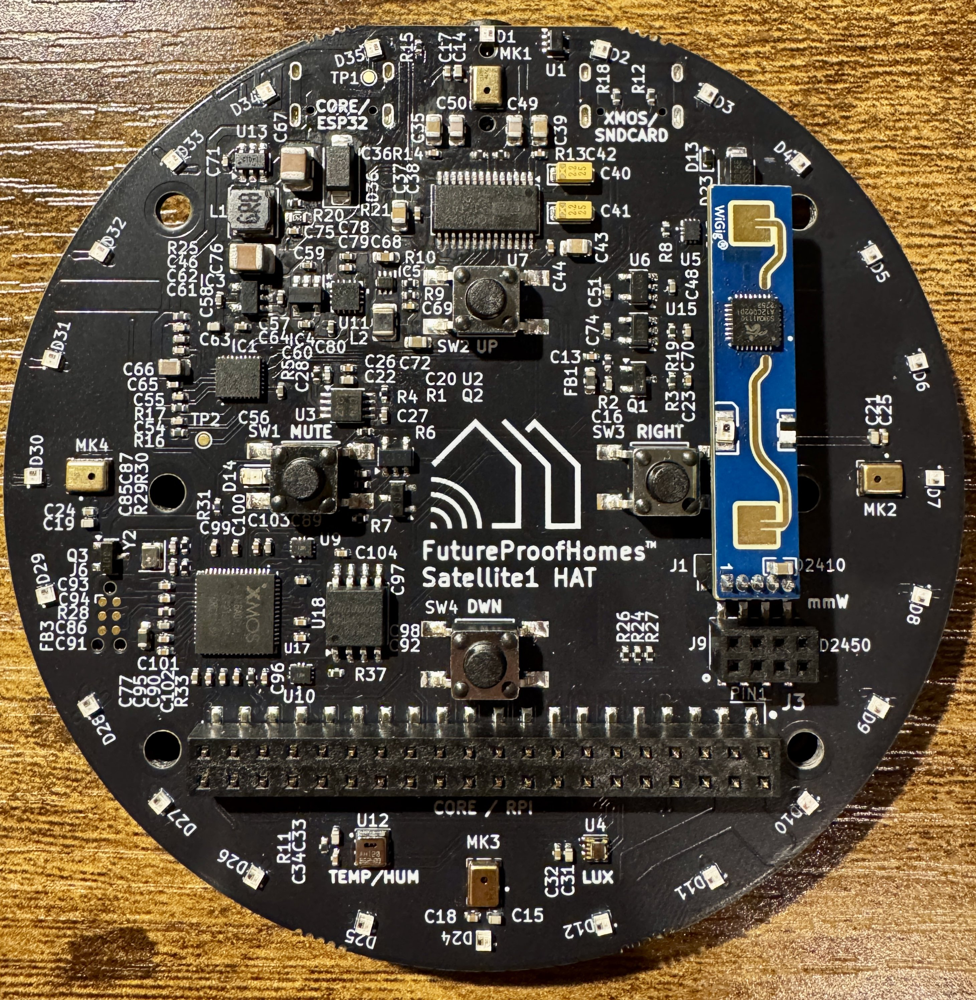
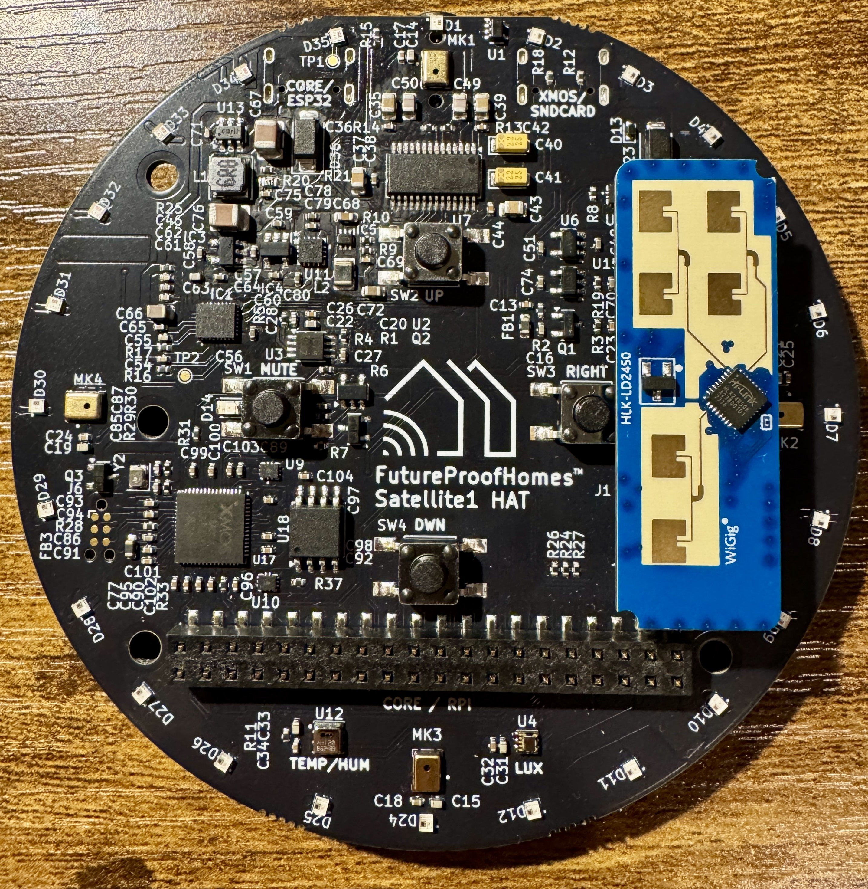
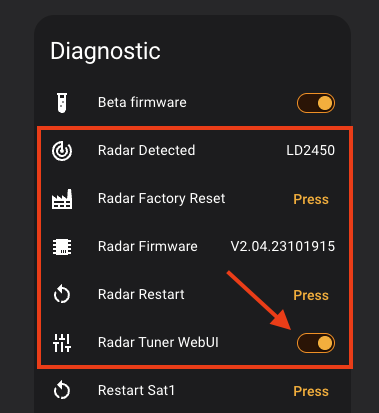
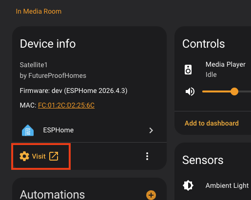

## Connecting mmWave Sensors

Satellite1 supports mmWave radar sensors for detecting human presence in a room. This is useful when you want Sat1 to automate actions like turning on a light or starting a conversation when someone enters.

The Sat1 HAT has headers for directly mounting either the LD2410 or LD2450 mmWave human presence sensor. Direct mounting is typically best for in-ceiling installations because the sensor points in the same direction as the LEDs and microphones.

The latest Satellite1.1 HAT also includes an LD2450 connector on the underside of the board. This lets you mount the sensor in any orientation with a 4-pin JST-ZH cable.

-  :material-numeric-1-circle:{ .lg .middle } __LD2410 mmWave module__

    ---

    The LD2410 is a small but capable presence sensor. It detects both motion and still human presence up to 6 meters away, with a detection angle of +/-60 degrees. For best results, tune it after installation. It can also detect through materials like glass walls and thin plywood.

    <figure markdown="span">
      { loading=lazy}
      <figcaption>Original Sat1 with direct-mounted LD2410</figcaption>
    </figure>
    

    ???+ warning "The LD2410B includes Bluetooth for updating the radar firmware. The standard LD2410 does not include Bluetooth. Sat1 is compatible with both versions."
    [Get LD2410 on Amazon](https://amzn.to/3C6utsf){ .md-button .md-button--primary }
    
-   :material-numeric-2-circle:{ .lg .middle } __LD2450 mmWave module__

    ---

    The LD2450 is a more advanced presence sensor. It can track up to 3 moving occupants while also detecting still human presence up to 8 meters away. It has a detection angle of +/-60 degrees and can detect through materials like glass walls and thin plywood.

    <figure markdown="span">
      { loading=lazy}
      <figcaption>Original Sat1 with direct-mounted LD2450</figcaption>
    </figure>
    <figure markdown="span">
      { loading=lazy}
      <figcaption>Latest Sat1.1 supports LD2450 connected with the included cable</figcaption>
    </figure>

    ???+ warning "The LD2450 must be running firmware version greater than V2.02.23090617 to work with ESPHome. Learn how to [update the firmware](#updating-mmwave-radar-sensor)."
    [Get LD2450 and Cable](https://futureproofhomes.net/products/ld2450-mmwave-human-presence-sensor){ .md-button .md-button--primary }

???+ "Not all enclosures support mmWave"

    Only some Satellite1 enclosures support mmWave sensors.

    1. Our new [Sat1.1 Smart Speaker](https://futureproofhomes.net/products/satellite1-smart-speaker) fits the LD2450 using a 4-pin cable.
    2. Our older DIY [Cylindrical Enclosure](satellite1-cylindrical-enclosure.md) fits both mmWave sensors when mounted directly to the HAT.
    3. In-ceiling enclosures are coming soon.

---

## Understanding the LD2410

  1. **Gate**: the LD2410 divides its detection range into distance bands called gates. Each gate can be tuned separately. Think of the gates like layers extending outward from the sensor. The LD2410 has 8 useful gates, plus gate 0, which is usually not helpful for tuning.

  2. **Distance Resolution**: distance resolution controls the size of each gate. The LD2410 can use 75 cm or 20 cm per gate. At 75 cm per gate, the maximum range is `0.75 * 8 =` 6 meters. At 20 cm per gate, the maximum range is 1.6 meters, but tuning can be more precise.

  3. **Energy**: energy is the amount of detected activity in a gate. More movement usually creates a higher energy value.

## Understanding the LD2450

  1. **Target Tracking**: unlike the gate-based LD2410, the LD2450 tracks up to 3 individual targets at the same time using X/Y coordinates. Each target reports its position, distance, speed, and direction, giving you a real-time map of where occupants are in the room.

  2. **Zones**: you can define up to 3 zones on the coordinate grid. When a target enters a zone, that zone's occupancy sensor turns on. You can also define an exclusion zone to ignore motion from areas like a ceiling fan or a window with moving curtains.

## mmWave Setup

### mmWave Sensors Are Automatically Detected

The latest firmware automatically detects if/which mmWave sensor is connected to your Sat1. To confirm detection, open your Sat1's **Diagnostics** section and scroll to the bottom to see which radar is listed.

!!! note "Upgrading from v0.1.x mmWave firmware?"

    Your previous Sat1 mmWave automations may need updates because v0.2.0 exposes new radar entities in the Sat1 ESPHome UI.

### Radar Tuner WebUI

The built-in **Radar Tuner WebUI** lets you visually calibrate your mmWave sensor from a web browser. You do not need Home Assistant dashboard cards or manual entity tuning.

-   :material-numeric-1-circle:{ .lg .middle } __Open Sat1 ESPHome Device UI__

    ---

    { loading=lazy }
    With a mmWave attached to your Satellite1, go to **"Settings -> Devices & Services -> ESPHome"** and find your Sat1 device.

    Toggle on **"Radar Tuner WebUI"** within the "Diagnostics" section.

-   :material-numeric-2-circle:{ .lg .middle } __Open the Radar Tuner WebUI__

    ---

    { loading=lazy }
    Open a web browser and navigate to your **Sat1's IP address** (for example, `http://192.168.1.xxx`), or click the **Visit** button in the Device Info section.

#### Tuning LD2450 Zones

The LD2450 tuner lets you draw **up to 3 detection zones** plus an **exclusion zone** on a visual radar map. Click the canvas to add points and define each zone boundary. This gives you precise control over where presence is detected.

{ width="100%" loading=lazy }

- **Zone 1 / Zone 2 / Zone 3**: Define areas where you want presence detection active. Left click to add points, right click to remove them. Click to move the shape around the screen.
- **Exclusion Zone**: Mark areas to ignore, such as a fan or a window with moving curtains.
- Adjust **Max Detection Range**, **Timeout**, **Stability**, and **Multi-Target Tracking** from the right-hand panel. Read the info popups.
- Click **"Save Zone"** after defining each zone, or **"Save All Zones"** to write the configuration to the sensor. This requires rebooting your Sat1.

After tuning, the relevant presence sensors and states will appear in your Sat1's ESPHome Device UI, ready for use in Home Assistant automations.

{ width="100%" loading=lazy }

#### Tuning LD2410 Gates

The LD2410 tuner provides a visual **gate energy chart** where you can see real-time moving and still energy levels for all 9 gates and adjust thresholds by dragging the dashed lines.

{ width="100%" loading=lazy }

- **Blue bars** = Moving energy per gate. **Green bars** = Still energy per gate.
- **Dashed lines** = Thresholds (drag up or down to adjust).
- Set **Max Moving Gate** and **Max Still Gate** to restrict detection range.
- Adjust the **Timeout** and **Distance Resolution** as needed.
- Click **"Save All"** to write changes to the sensor.

After tuning, the relevant presence sensors and states will appear in your Sat1's ESPHome Device UI, ready for use in Home Assistant automations.

---

## Updating mmWave Radar Sensor
Both the LD2410 and LD2450 can be updated over Bluetooth with the HLKRadarTool mobile app. Download the app, then watch the quick video below to learn how to access the sensor and change the firmware version.

  
  

<iframe style="width: 100%; aspect-ratio: 16 / 9;" src="https://www.youtube.com/embed/t8-JdVVVH34?si=3HRSFepdfceSfEtx" title="YouTube video player" frameborder="0" allow="accelerometer; autoplay; clipboard-write; encrypted-media; gyroscope; picture-in-picture; web-share" referrerpolicy="strict-origin-when-cross-origin" allowfullscreen></iframe>
