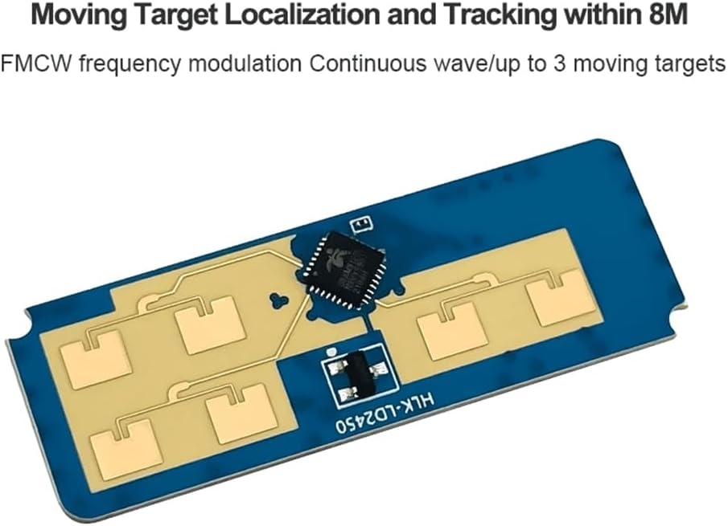

## Satellite1 Power Supply

To power the Sat1 speaker using its built-in amplifier, you’ll need a 9V USB-C power supply with a capacity of 20W-30W. Here are some recommended options.

  { width="30%" loading=lazy } 
  Cheap no name brands have risks, but this 20W (2.23A @ 9V) power adapter has worked well.
  [Get it on Amazon](https://amzn.to/4fRLZ1f){ .md-button .md-button--primary }

  { width="30%" loading=lazy } 
  A brand name 30W power adapter is a safer bet (3A @ 9V).
  [Get it on Amazon](https://amzn.to/4jfrO04){ .md-button .md-button--primary }

  { width="30%" loading=lazy } 
  Don't forget some standard USB-C cables.  These have been solid in my testing:
  [Get it on Amazon](https://amzn.to/42gcVEZ){ .md-button .md-button--primary }

## Speaker and Connectors
You can get audio out of your Sat1 by plugging in headphones, or externally amplified speakers to the 3.5mm headphone jack.  Or you can power a single mono speaker directly off the Sat1 amplifier (if you have a 9V power supply).

 { width="60%" loading=lazy } 

Here are the supplies to connect a speaker to your Sat1:

 { width="60%" loading=lazy } 
 JST XH2.54-2P 2.54mm Pitch 2 Pin Male Connector
 [Get it on Amazon](https://amzn.to/4ly9LDA){ .md-button .md-button--primary }

 { width="60%" loading=lazy } 
 These Dayton Audio RS75-4 3" Reference Full-Range speakers are easy to find, sound amazing, and fit perfectly in our enclosure.
 [Order from Amazon](https://amzn.to/42egKsz){ .md-button .md-button--primary }

 { width="60%" loading=lazy } 
 These Tectonic TEBM46C20N-4B BMR 3" Full-Range speaker are very hard to find, also sound wonderful and fit perfectly in our enclosure.  The smaller tab is (-) and goes to the BLACK  wire, and the bigger tab is (+)and goes to the RED wire.
 [Order from Parts Express](https://www.parts-express.com/Tectonic-TEBM46C20N-4B-BMR-3-Full-Range-Speaker-4-297-2157?quantity=1){ .md-button .md-button--primary }

## mmWave Human Presence Detectors

Your Sat1 also supports the Human Presence Sensing Radar Modules LD2410 or LD2450.  Please be sure to read about how to calibrate your mmWave sensors.

 { width="60%" loading=lazy } 
 HLK-LD2410 mmWave is smaller sensor that is good at presence detection if the occupant is still in the room.  Note that this sensor can only detect one person at a time and cannot determine exactly where the person is in the room.  If multiple people are in the room it will focus on the person with the most "energy" or motion.
 [Get it on Amazon](https://amzn.to/3C6utsf){ .md-button .md-button--primary }

 { width="60%" loading=lazy } 
 HLK-LD2450 mmWave is a larger sensor that offers everything the ld2410 has, plus it can detect up to 3 moving persons and their position in the room.  NOTE: this sensor is not yet supported by ESPHome and we're dependent on a PR that we hope Home Assistant will soon merge.
 [Get it on Amazon](https://amzn.to/4hcKtrK){ .md-button .md-button--primary }